# PowerInsight ⚡

IoT-based real-time energy monitoring system for homes — **ESP32 + ABB B24 energy meter + Flutter**.

PowerInsight reads live electricity data (voltage, current, power, power factor, energy) from a Modbus RTU energy meter via ESP32, publishes it to Firebase Realtime Database, and presents it in a clean Flutter app with **daily / weekly / monthly analytics**, usage trend graphs, peak-time heatmaps, and **real K-Electric bill estimation** — all in **English & Urdu (اردو)**.

---

## ✨ Features

| Feature | Description |
|---|---|
| 🔴 **Real-time monitoring** | Live voltage, current, power (W), frequency, power factor — refreshes every ~3s |
| 📈 **Power trend graph** | Day view = 24-hour curve (0h–24h axis, fills hour-by-hour), Week = 7 day slots, Month = week slots (W1–W5) |
| 🔥 **Peak hours heatmap** | Time slots (6 AM–9 PM) × Day/Week/Month — see exactly *when* you consume the most |
| 💰 **K-Electric bill estimate** | Real KE tariff slabs (A1-R), FCA, quarterly adjustment, electricity duty, GST, MUCT, TV licence — matches actual bills |
| 📊 **Monthly comparison** | Bill vs previous months + 5-month average |
| 🌐 **Bilingual UI** | Full English + Urdu translation, switchable in-session |
| 👥 **Admin panel** | Add customers, assign meters, manage users |
| 🤖 **ML prediction** | Next-month usage forecast |
| 🟢 **Meter online status** | Clock-skew-immune liveness detection from reading timestamps |

---

## 🏗️ Architecture

```
┌─────────────┐   Modbus RTU    ┌──────────┐    HTTPS PUT    ┌─────────────────┐
│  ABB B24    │ ◄──────────────►│  ESP32   │ ───────────────►│  Firebase RTDB  │
│ Energy Meter│    RS485        │ (WiFi)   │   every 2s      │  meters/meter1  │
└─────────────┘                 └──────────┘                 └────────┬────────┘
                                                                      │
                                                            ┌─────────▼────────┐
                                                            │   Flutter App    │
                                                            │  (GetX, REST)    │
                                                            │  Android / iOS   │
                                                            └──────────────────┘
```

**Data flow:** Meter → (RS485/Modbus) → ESP32 → (WiFi/HTTPS) → Firebase → (REST) → App

---

## 🔌 Hardware

| Component | Details |
|---|---|
| **Energy meter** | ABB B24 (Modbus RTU slave, ID `10`, 19200 baud, 8E1) |
| **Controller** | ESP32 (WiFi + dual-core) |
| **RS485 transceiver** | DE/RE on GPIO 4, RX2 = GPIO 16, TX2 = GPIO 17 |
| **Registers used** | Voltage `0x5B00`, Current `0x5B0C`, Power `0x5B14`, Frequency `0x5B2C`, PF `0x5B3A`, Energy `0x552C` |

NTP time sync (`pool.ntp.org`, UTC+5) is used for date/hour keys.

---

## ☁️ Firebase Realtime Database structure

```
meters/
└── meter1/
    ├── name                      "ABB B24"
    ├── latest/                   ← live reading (every 2s)
    │   ├── voltage, current, power, frequency, powerFactor, energy
    │   └── timestamp             ← server timestamp (.sv)
    ├── history/                  ← daily cumulative kWh (every 60s)
    │   └── 2026-10-01: 0.24
    └── hourly/                   ← hourly cumulative kWh (hour change)
        └── 2026-10-01/
            ├── h0: 0.22
            └── h1: 0.23
```

- **`history`** → daily consumption deltas → Week trend, Month trend, bill estimates
- **`hourly`** → hourly deltas → Day power trend (24h) + peak-hours heatmap
- Cumulative values are stored; the **app computes deltas** (meter resets handled → treated as 0)

---

## 📱 App screens

| Screen | What it shows |
|---|---|
| **Splash / Login** | Email validation, secure session |
| **Meters list** | All your meters with online/offline status |
| **Dashboard** | Live power hero card, voltage/current/PF/frequency tiles |
| **Analytics** | Day/Week/Month tabs → summary KPIs, power trend, peak heatmap, consumption & cost charts |
| **Bills** | K-Electric style invoice breakdown, month comparison, tariff settings (phase, FCA, TV count) |
| **Profile / Settings** | User info, language switch, tariff configuration |
| **Admin panel** | Customer + meter management |

---

## 📱 Screenshots

| | |
|---|---|
| 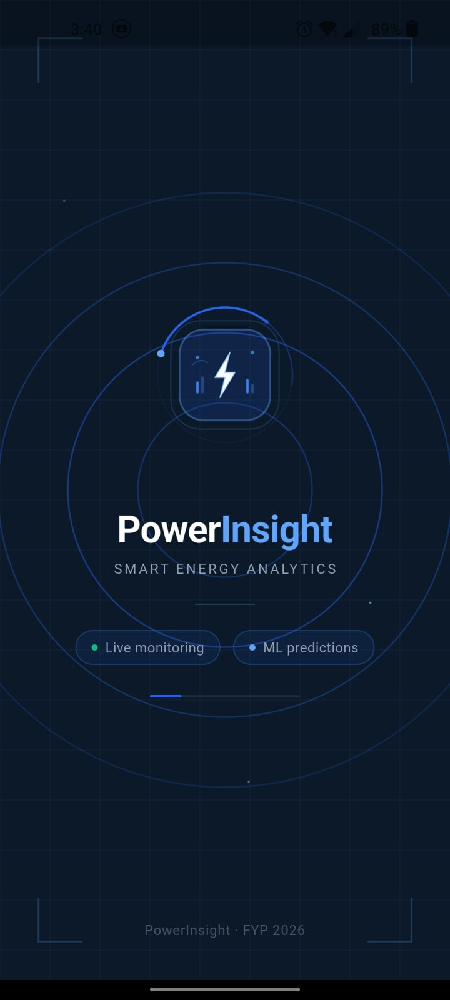 | 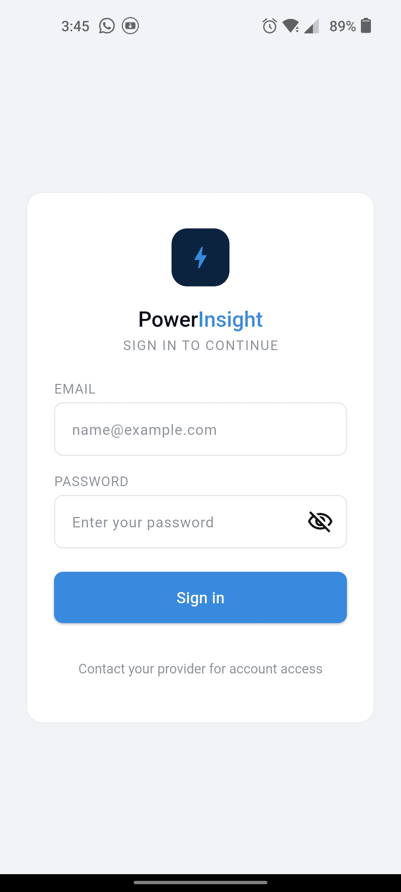 |
| *Splash screen* | *Login* |
| 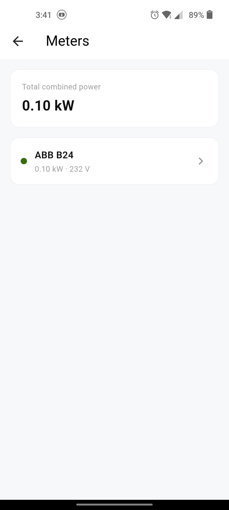 | 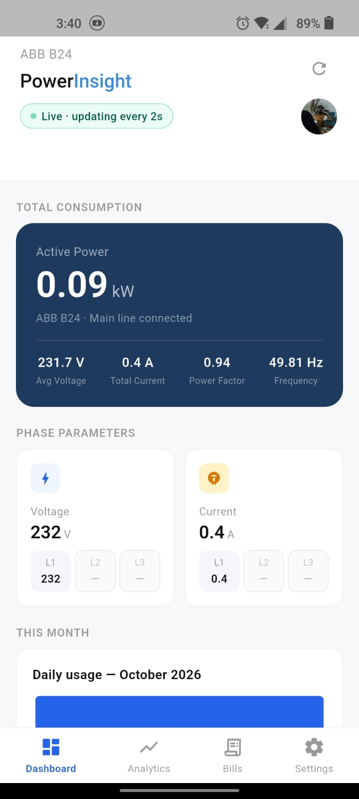 |
| *Meters with live status* | *Real-time dashboard* |
| 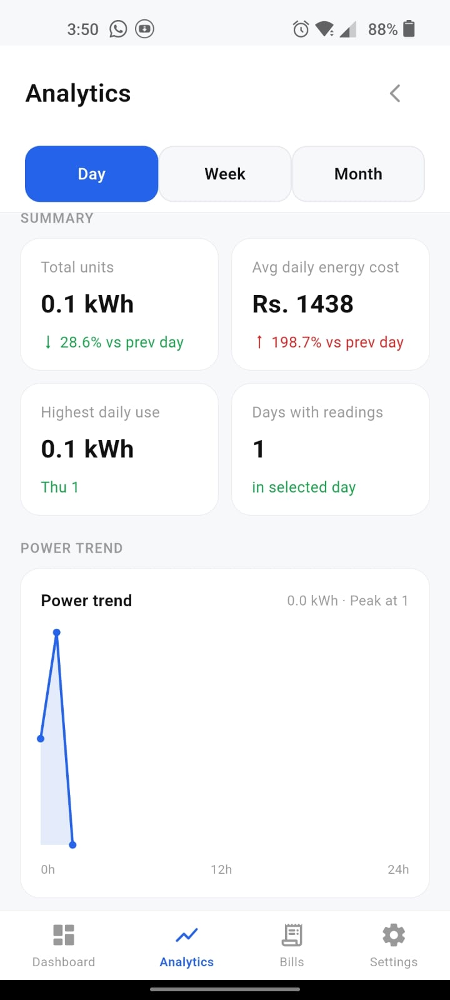 | 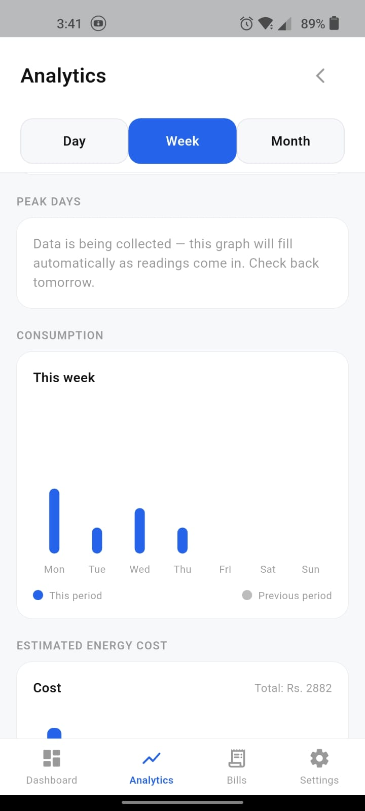 |
| *Analytics — Day (24h trend)* | *Analytics — Week (peak days)* |
| 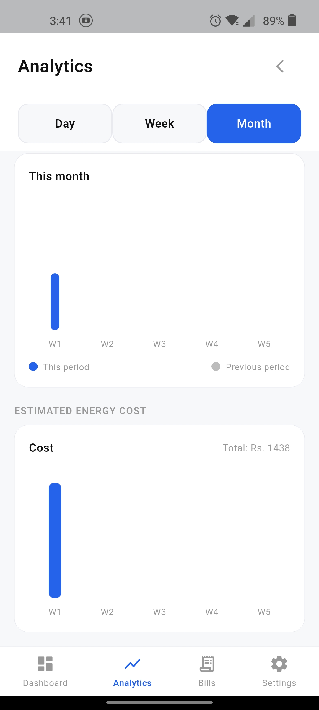 | 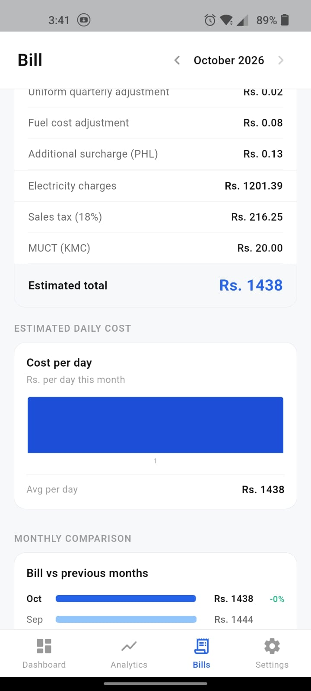 |
| *Analytics — Month (peak weeks)* | *K-Electric bill estimate* |
| 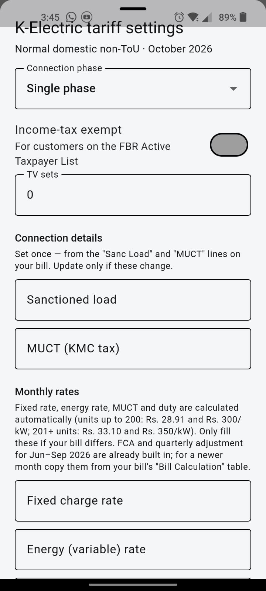 | 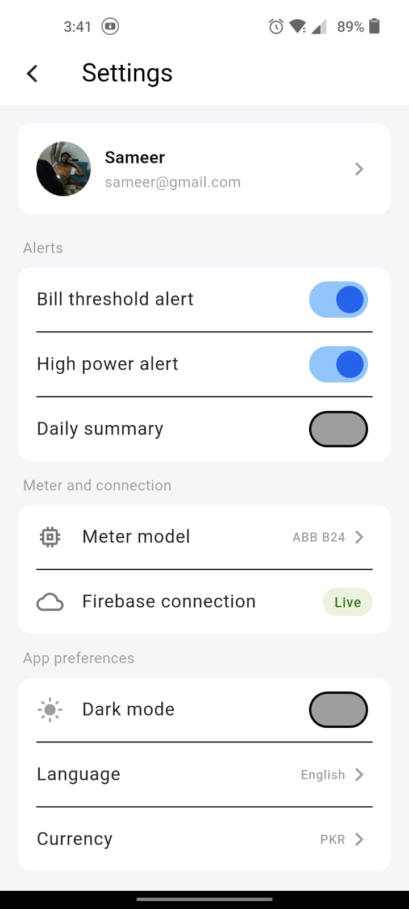 |
| *Tariff configuration* | *Settings — اردو* |
| 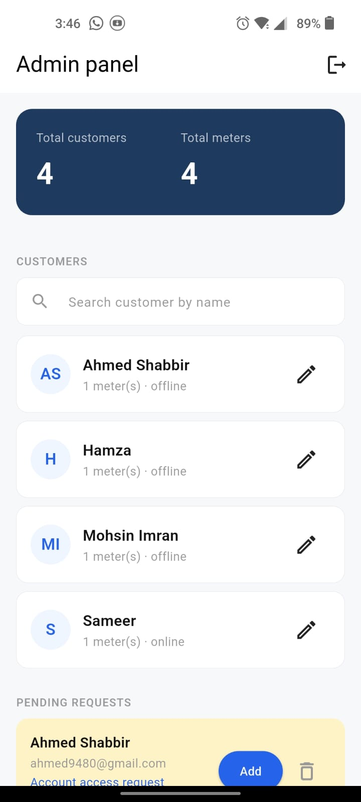 | 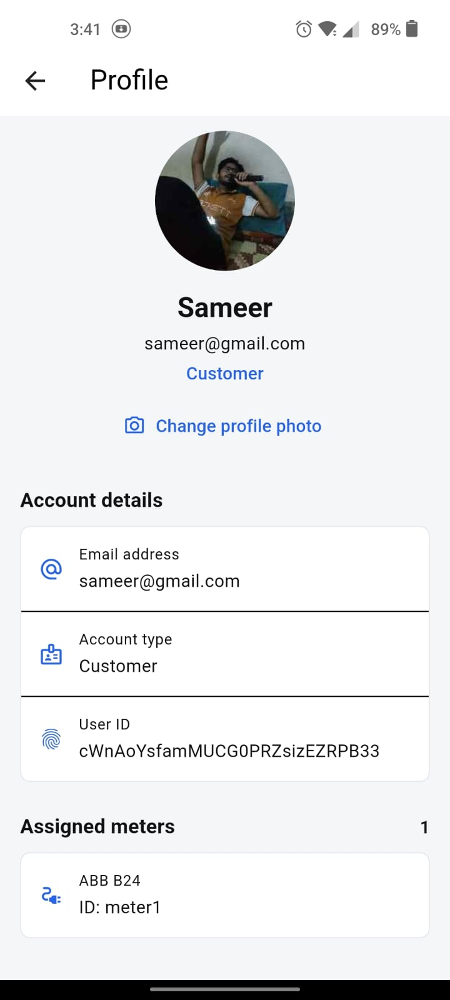 |
| *Admin panel* | *Profile* |

---

## 🚀 Getting started

### Prerequisites
- Flutter SDK (tested with Dart ^3.10)
- Android/iOS device or emulator
- Arduino IDE + ESP32 board support (for the meter firmware)

### Run the app
```bash
git clone <repo-url> && cd finalyearproject
flutter pub get
flutter run
```

> macOS with custom SDK path: `export PATH="$HOME/development/flutter/bin:$PATH"` first.

### Tests
```bash
flutter test        # 16 tests: history/hourly parsing, KE bill calculator, widgets
flutter analyze     # static analysis — clean
```

### ESP32 firmware
1. Arduino IDE → install **ModbusMaster** library
2. Update `WIFI_SSID`, `WIFI_PASSWORD`, `FIREBASE_DB_URL` in the sketch
3. Flash to ESP32 — it auto-connects, syncs NTP time, and starts publishing

---

## 🧾 Bill estimation accuracy

The KE calculator was validated against **real K-Electric bills** (Jun–Sep 2026) and matches to the paisa — including slab changes at 200/201 and 300 units, `Rs 300/kW` fixed charges (Sep 2026 tariff), FCA from older bills, PHL surcharge, 18% sales tax, MUCT, and TV licence fee. See `lib/models/ke_tariff_model.dart` and the test suite.

---

## 📄 License

Academic project — Final Year Project, 2026.
