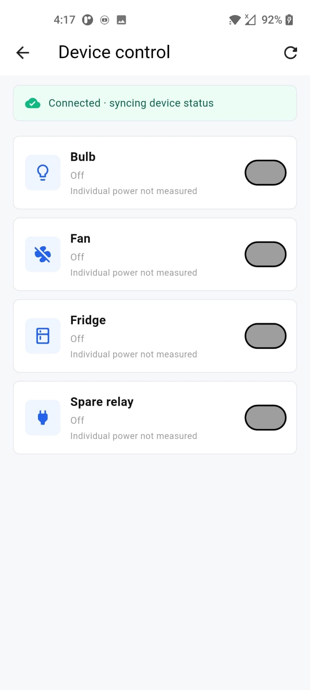

# PowerInsight

**PowerInsight** is an IoT-based energy monitoring and appliance-control system built with an ESP32, an ABB B24 energy meter, Firebase Realtime Database, and a Flutter mobile app.

The meter sends live electrical readings to Firebase, where the app presents them as a dashboard, usage analytics, and estimated K-Electric bills. A separate relay-control path lets users send appliance commands from the app and view the state reported by the ESP32.

## Highlights

- **Live energy monitoring:** voltage, current, active power, frequency, power factor, and cumulative energy.
- **Day, week, and month analytics:** summary cards, consumption and cost charts, usage trends, and peak-usage heatmaps.
- **K-Electric bill estimates:** configurable tariff profile and an itemized estimate including applicable adjustments, taxes, and fees.
- **Appliance controls:** Firebase-backed controls for a bulb, fan, fridge, and spare relay, with requested and ESP32-reported states.
- **Multiple meters and accounts:** sign-in, meter assignment, customer administration, and meter online status.
- **English and Urdu:** switch the app language in-session; light and dark themes are supported.
- **Profile and preferences:** account details, profile photo, and app settings.

## System overview

```text
 ABB B24 energy meter
          │ RS-485 / Modbus RTU
          ▼
       ESP32 ────────────────┐
          │                 │
          │ meter readings  │ relay commands / status
          ▼                 ▲
   Firebase Realtime Database
          │                 ▲
          │ REST API        │ REST API
          ▼                 │
       Flutter app ─────────┘
       monitoring, analytics,
       billing, and controls
```

Meter readings and device-control commands are separate data flows. For device control, the app writes the requested state to Firebase. The ESP32 polls for commands, drives its configured relay, and writes the applied state back for the app to display.

## Application screens

| Screen | Overview |
|---|---|
| Login | Account sign-in |
| Meter list | Assigned meters and their availability |
| Dashboard | Live meter readings, status, and navigation |
| Device control | Relay controls and device status |
| Analytics — day | Hourly usage trend and daily heatmap |
| Analytics — week | Daily usage trend and weekly heatmap |
| Analytics — month | Monthly usage trend and peak-week heatmap |
| Bills | Estimated bill and month comparison |
| Tariff settings | Tariff profile and bill-adjustment inputs |
| Settings | Language, theme, account, and app preferences |
| Profile | User details and profile photo |
| Admin panel | Customer and meter administration |

## Screenshots

| | |
|---|---|
|  |  |
| *Splash* | *Login* |
|  |  |
| *Assigned meters* | *Live dashboard* |
|  |  |
| *Relay controls and connection status* | *Hourly trend and peak hours* |
|  |  |
| *Daily comparison and peak days* | *Monthly comparison and peak weeks* |
|  |  |
| *Estimated K-Electric bill* | *Tariff configuration* |
|  |  |
| *Settings in Urdu* | *User profile* |
|  | |
| *Customer and meter administration* | |

## Hardware

| Component | Configuration |
|---|---|
| Energy meter | ABB B24, Modbus RTU slave ID `10`, `19200` baud, `8E1` |
| Controller | ESP32 with Wi-Fi |
| RS-485 direction control | GPIO `4` |
| ESP32 serial pins | RX2 GPIO `16`, TX2 GPIO `17` |
| Meter registers | Voltage `0x5B00`, current `0x5B0C`, power `0x5B14`, frequency `0x5B2C`, power factor `0x5B3A`, energy `0x552C` |
| Relay outputs | Bulb GPIO `25`, fan GPIO `26`, fridge GPIO `27`, spare GPIO `32` |

The firmware uses NTP time synchronization (UTC+5) to label daily and hourly history records. Relay outputs are configured as active-low. The fridge relay includes a five-minute minimum off-time before it can be switched on again.

> **Device power figures:** the control screen reports that individual appliance power is not measured. The firmware's relay status payload includes configured nominal estimates, not readings from per-appliance power sensors; the ABB meter measures the installation's aggregate consumption.

## Firebase data model

```text
meters/{meterId}/
├── name
├── latest/
│   ├── voltage
│   ├── current
│   ├── power
│   ├── frequency
│   ├── powerFactor
│   ├── energy
│   └── timestamp
├── history/{YYYY-MM-DD}                 # cumulative daily energy
└── hourly/{YYYY-MM-DD}/h{hour}          # cumulative hourly energy

devices/{deviceId}/
├── state                                  # requested relay state
├── applied                                # ESP32-reported relay state
├── power                                  # configured estimate, not metered
└── lastUpdate
```

- `latest` powers the live dashboard.
- `history` and `hourly` contain cumulative meter readings. The app derives usage deltas for analytics and estimates.
- `devices/{deviceId}/state` carries the app's requested state. The ESP32 updates `applied` after handling the command.
- The control page polls Firebase for status every two seconds; firmware polls for commands every 500 ms.

## Project structure

```text
lib/
├── bindings/       # GetX dependency bindings
├── controllers/    # Application state and business logic
├── models/         # Meter, analytics, billing, and device models
├── routes/         # Application navigation
├── services/       # Firebase REST and tariff services
├── themes/         # Light and dark themes
├── translations/   # English and Urdu strings
├── views/          # Application screens
└── widgets/        # Reusable UI components

sketch_sep26a/
└── sketch_sep26a.ino

screenshots/
```

## Getting started

### Requirements

- Flutter SDK with Dart `^3.10.9`
- Android or iOS device/emulator for the mobile application
- For hardware deployment: ESP32, ABB B24 meter, compatible RS-485 transceiver, and a properly rated relay module
- Arduino IDE and the `ModbusMaster` library to build the ESP32 firmware

### Run the Flutter app

```bash
git clone <repository-url>
cd finalyearproject
flutter pub get
flutter run
```

If Flutter is installed outside `PATH`, add its `bin` directory first:

```bash
export PATH="$HOME/development/flutter/bin:$PATH"
```

### Run checks

```bash
flutter test
flutter analyze
```

### Build and flash the ESP32 firmware

1. Open `sketch_sep26a/sketch_sep26a.ino` in Arduino IDE.
2. Install the **ModbusMaster** library and select the appropriate ESP32 board.
3. Configure Wi-Fi, Firebase, meter, RS-485, and relay settings for your own installation.
4. Verify the meter register map, relay polarity, GPIO assignments, and Firebase access rules before deployment.
5. Flash the firmware and confirm meter readings and device status in Firebase before using the app controls.

Never commit Wi-Fi passwords, service credentials, or other private configuration values to a public repository. Use appropriately restricted Firebase Database Rules for a deployment; do not rely on permissive public database access.

> **Electrical safety:** mains-voltage wiring and relay installation should be designed and checked by a qualified person. Disconnect power before wiring, use correctly rated and enclosed components, and follow local electrical codes.

## Bill estimates

The tariff calculator is covered by regression tests based on K-Electric bill examples included in the test suite. Estimates depend on the configured tariff profile and the available consumption history; they are informational and may differ from the final bill.

## License

Academic Final Year Project, 2026. No separate open-source license is currently specified.
